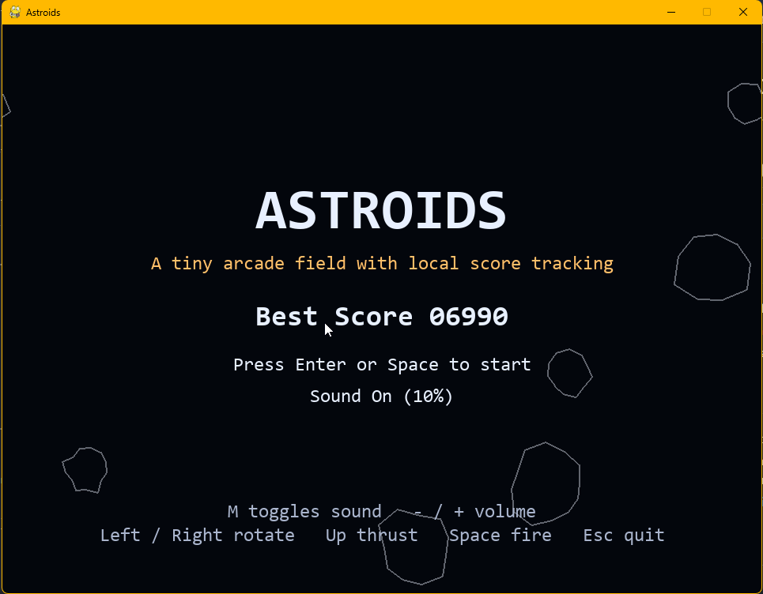
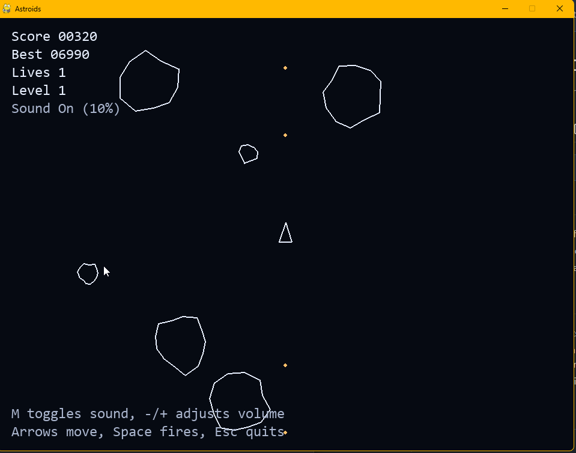
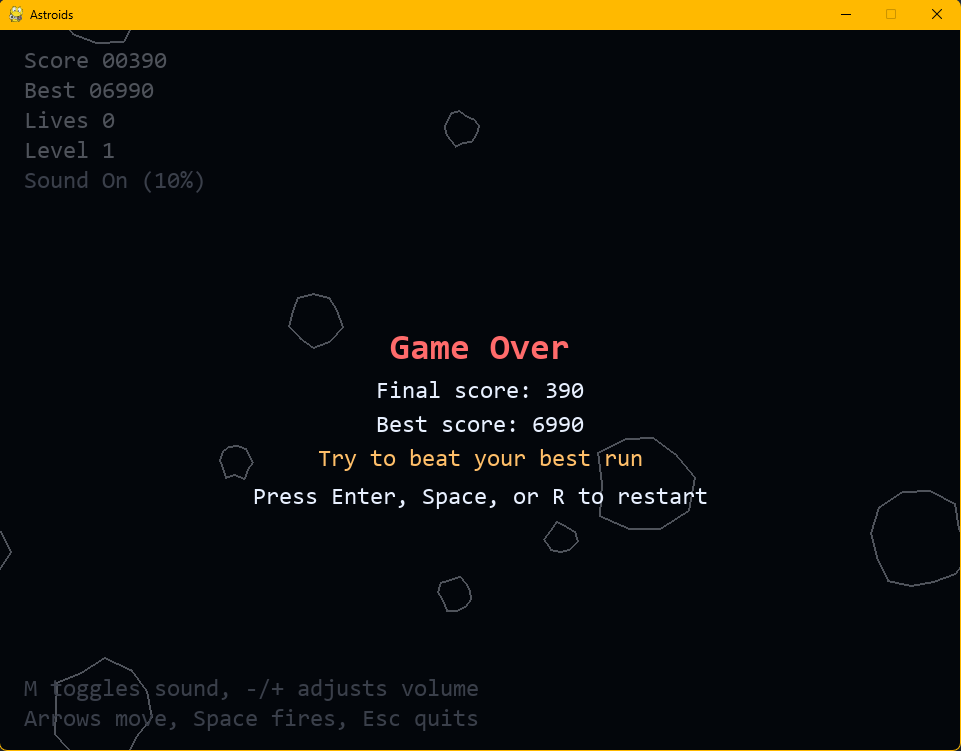

# Asteroids AI Demo

`Asteroids AI Demo` is a compact arcade game built with Python and `pygame`. It is intentionally small, easy to read, and polished enough to show how an AI coding agent can help turn a rough idea into a working project through short iterative requests.

This repo is useful as both:

- a playable Asteroids-style sample project
- a lightweight example of AI-assisted software delivery

## Why This Repo Exists

I wanted a public example that shows practical collaboration with an AI coding agent instead of just talking about it in the abstract. The game started as a simple playable loop and was then iteratively improved with features like score tracking, sound effects, particle bursts, title/game-over screens, and persistent sound settings.

The result is a repo that is small enough to understand quickly, but complete enough to demonstrate:

- breaking work into incremental requests
- refining a project over multiple passes
- reviewing and shaping AI output instead of treating it as magic
- ending with something shippable, documented, and shareable

## Features

- Smooth ship rotation, thrust, shooting, and screen wrapping
- Asteroid splitting with score progression and lives
- Title screen and game-over restart flow
- Generated retro sound effects with no external asset files
- Runtime sound toggle and volume control
- Local persistence for best score and sound settings
- Particle bursts for asteroid and ship destruction

## Screenshots

### Title Screen



### Gameplay



### Game Over



## AI-Assisted Workflow

This project was built collaboratively with an AI coding agent. The human side provided direction, chose tradeoffs, reviewed the results, and decided what to keep. The agent accelerated implementation, edits, and cleanup.

A few examples of iterative improvements made through that workflow:

- start with a playable arcade loop
- add scoring, lives, and restart behavior
- add synthesized sound effects and particles
- add sound on/off plus volume controls
- persist user sound preferences locally
- tighten documentation for public sharing

More detail is in [AI_COLLABORATION.md](AI_COLLABORATION.md).

## Tech Notes

- Language: Python 3.11+
- Library: `pygame`
- Main entry point: [main.py](main.py)
- Local save file: `.asteroids-save.json`

The game logic currently lives in a single file on purpose. For a larger project, I would split rendering, entities, audio, and persistence into separate modules, but keeping it compact makes the implementation easy to inspect in a portfolio setting.

## Controls

- `Enter`: start from the title screen or restart after game over
- `Left` / `Right`: rotate
- `Up`: thrust
- `Space`: fire
- `M`: toggle sound on/off
- `-` / `+`: lower or raise volume
- `R`: restart after game over
- `Esc`: quit

## Run Locally

```powershell
python -m venv .venv
.venv\Scripts\Activate.ps1
pip install -r requirements.txt
python main.py
```

## What This Demonstrates

If you are looking at this repo as a hiring manager or teammate, the value is less about the size of the game and more about the workflow it represents:

- using AI to move quickly on implementation details
- keeping the work grounded in concrete, reviewable code
- iterating from a simple starting point to a more complete product
- documenting the result clearly enough for someone else to run and assess

## License

This project is available under the MIT License. See [LICENSE](LICENSE).
